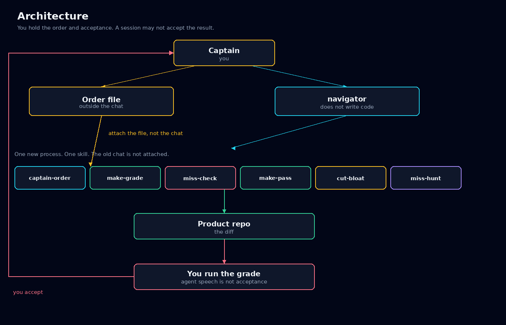
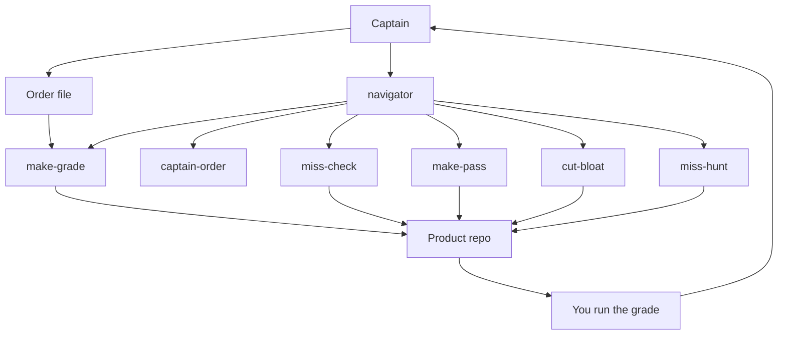
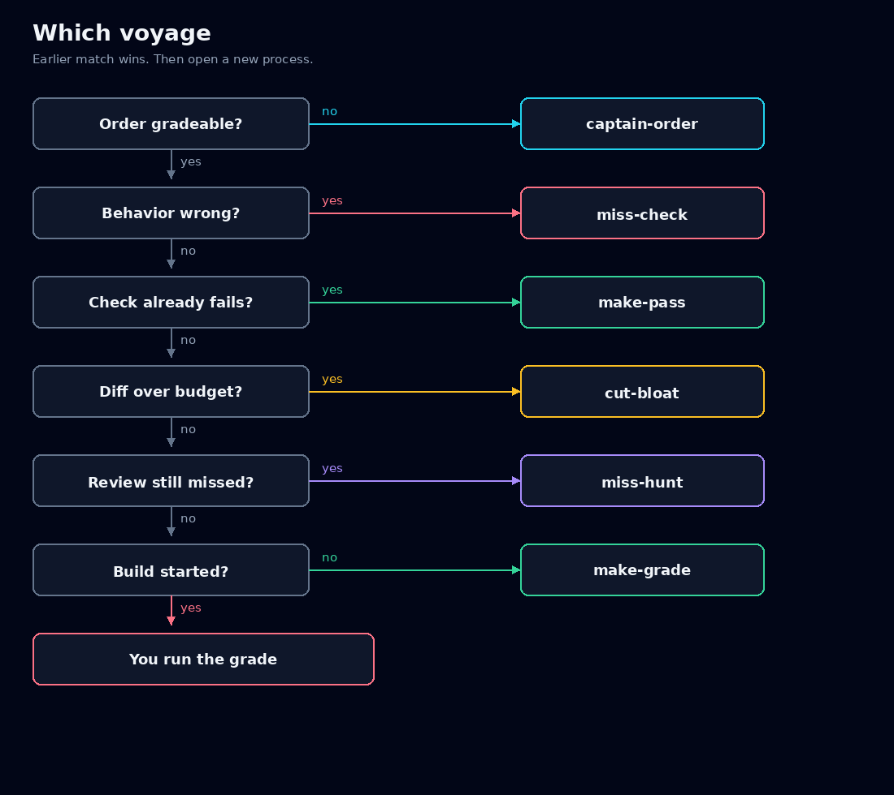
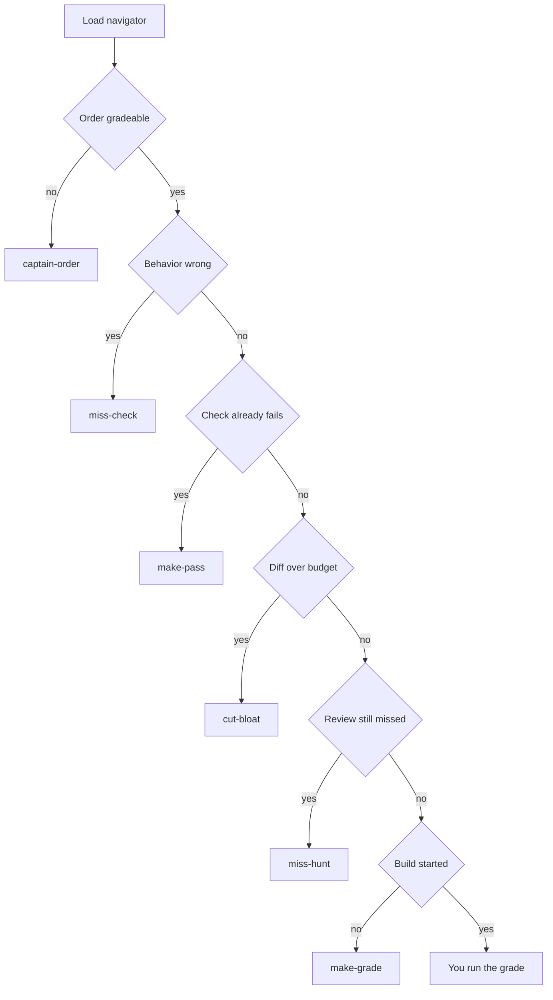
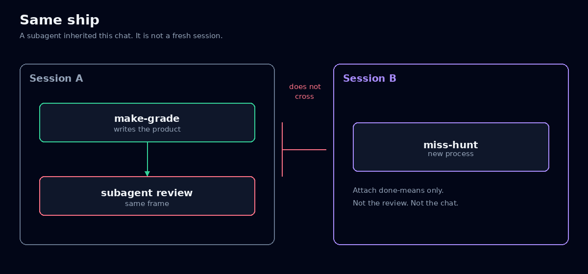
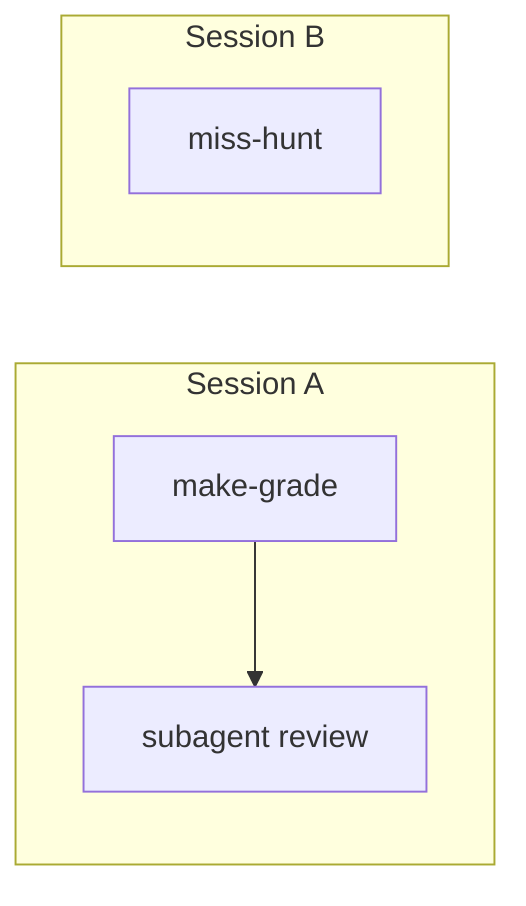
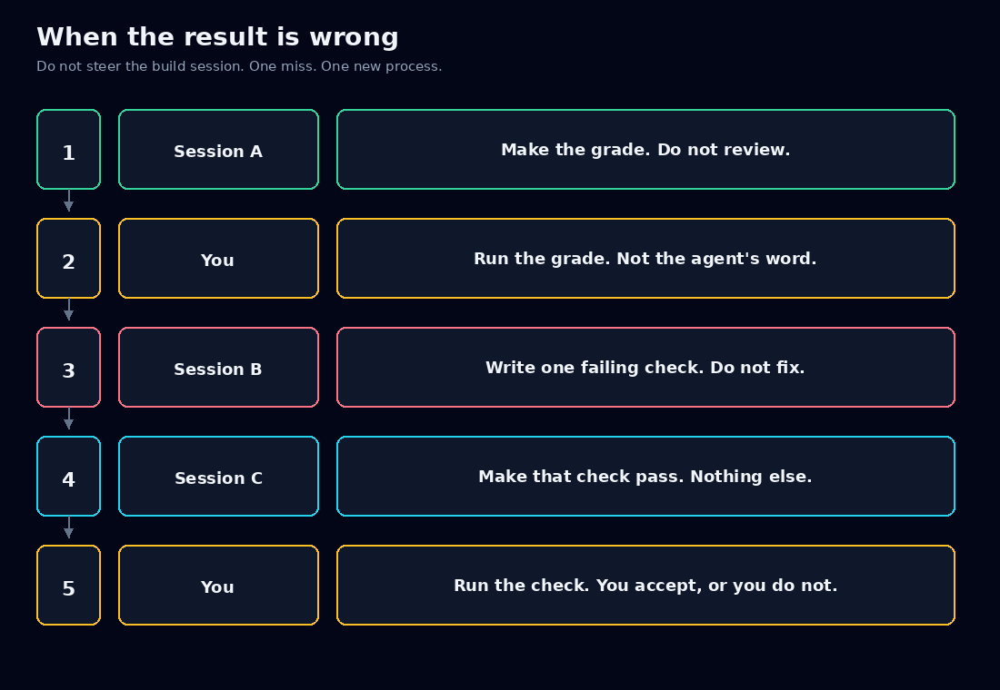
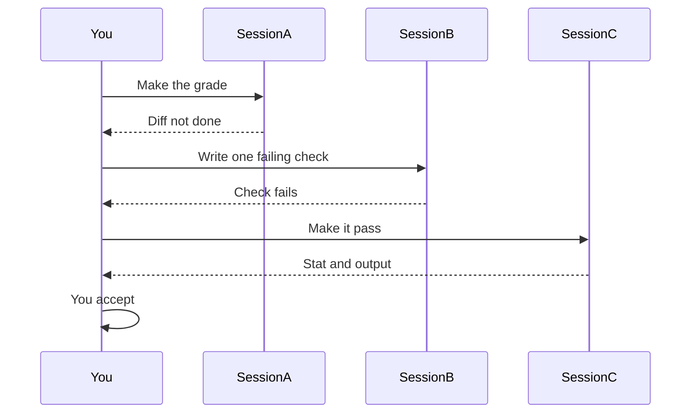

# How to captain

The agent is the crew. You are the captain. The crew does not get to report that it arrived.

Each skill is one voyage. A voyage is a new process, with only the charge attached. `--continue` is the same ship. A subagent spawned from the build is the same ship. It inherited the frame. That is why a review inside the build session only lists cases the build already thought of.

The order lives in a file or a ticket. If it only exists in the chat, it does not exist.

The pictures are the maps. The mermaid under each one is the same map in text. GitHub draws that text in a separate frame, and that frame drops diagrams that contain punctuation, subgraphs, or a dotted label. If you still see a code block, read the picture.

## Architecture

You hold two things the agent is not allowed to hold: the order, and acceptance.





The dashed lines are the trust boundary. The agent may read the order. It may not decide that the order changed. It may run a command to see a failure. It may not accept the result. You do that, by running the grade where you can see the output.

Install once, outside the repo the agent is changing. See the [README](../README.md). Then add one line to your own harness config, not to the project:

```
Before writing or editing code, load navigator. If it says open a new session, stop.
```

Start a new session after install. A session that was already running will not see the skills.

## Which voyage

Load navigator first. It does not write code. If two of these are true, the earlier one wins. It will hand you a paste. Open a new process and paste that. Do not keep talking in the session that classified the work.





## Same ship

This is the failure that feels like progress. The build session spawns a reviewer. The reviewer shares the parent's frame. It finds the cases the parent already imagined. The miss you care about was never in that frame, so another subagent will not find it either.





A subagent may do a narrow task already ordered inside the current voyage. It may not be the grader, the hunt, or the cut. Those need a process that never saw this chat.

## When the result is wrong

Do not steer the build session. Steering teaches it to patch the sentence you just typed. Stop. Write one line, in your words: when I do X, I expected Y, I got Z. That line is the only charge the next process gets.





One miss per voyage. Three misses are three checks, and the first of those sessions does not write product code until the check exists and fails for the reason you named.

If you still do not trust it after the grade is green, that is not a reason to read the diff. Open `miss-hunt` in a new process. Attach the done-means sentence and how to run the thing. Do not attach the review plan, the implementation chat, or a summary of what was fixed. It must find 3 inputs where the result is wrong, and add a failing test for each. Fewer than 3 is `REVIEW_FAILED`, not a soft pass. You keep the real misses and drop the ones that are just thorough. Each kept miss is a later `make-pass`.

## Bloat is a stat

Do not read a fat diff to decide if the extra was reasonable. Run `git diff --stat` first. Default budget, if the order did not set one: one behavior, at most 3 files, no new dependency, no new top-level directory. Over budget goes back unread.

Correctness and cutting are different voyages. If the named checks are failing, that is `miss-check`, not `cut-bloat`. A cut session that is also allowed to improve the code will grow it again.

## A small loop

Say the order is: a save button stays disabled until the name field is non-empty.

The file, not the chat:

```
Done means: Save stays disabled until Name is non-empty.
Grade:
- V1: Name empty. Save is disabled.
- V2: Type one character. Save enables.
- V3: Clear Name. Save disables again.
Not this: no new settings page.
Stop and ask: merge, or any change to Done means.
Budget: one behavior, at most 3 files, no new dependency.
```

Then the processes, in order, each one new:

1. `Load navigator. Do not write code.`
2. `Load captain-order. Fill the four lines. Do not write code.` You already filled them, so this step is short. It still does not implement.
3. `Load make-grade. The order is attached. Make the grade commands pass. Do not review. Stop at budget.`
4. You run V1, V2, and V3. If they pass and the stat is inside budget, stop. You are done.
5. If V2 fails, stop that session. New process: `Load miss-check. When I type one character in Name, I expected Save to enable, I got Save still disabled. Write one failing check. Do not fix.`
6. New process: `Load make-pass. This check fails: <path>. Make it pass. Touch nothing else.`
7. You run the check. If the diff grew a settings page or a new dependency, new process: `Load cut-bloat. Delete whatever the named checks do not need. Do not add code.`

Unease you cannot name is a fuzzy order. Send that one behavior back to `captain-order`. Do not read 800 lines to soothe it.

## What you paste

Navigator ends every advice turn with four labels: voyage, why this session cannot do the next step, the paste, and what it refused. Use the paste as-is.

```
Load <skill>. Do not mix voyages.
<one charge sentence>
```

- captain-order: `Fill the four lines. Ask one question at a time. Do not write code.`
- make-grade: `The order is attached. Make the grade commands pass. Do not review. Stop at budget.`
- make-pass: `This check fails: <path>. When I do X, I expected Y, I got Z. Make it pass. Touch nothing else.`
- miss-check: `When I do X, I expected Y, I got Z. Write one failing check. Do not fix.`
- cut-bloat: `Delete whatever the named checks do not need. Do not add code. Show diff --stat before and after.`
- miss-hunt: `Done means: <sentence>. Find 3 inputs where the result is wrong. Add a failing test for each. Do not fix.`

Silence, "ok", and "just do it" are not permission to mix voyages. The override is the sentence `stay in this session`, and even then it does one voyage only.

## What not to add

Do not install a review skill that runs in the build session. That is the miss.

Do not install a skill that does the red and the green in one conversation. `miss-check` writes the failing check. `make-pass` makes it pass. Combining them puts the fix in the session that just invented the test, which is how the test learns to pass for the wrong reason.

Do not commit these skills into a repository you do not own. They live in your harness config. The project sees a normal diff, or it does not.
